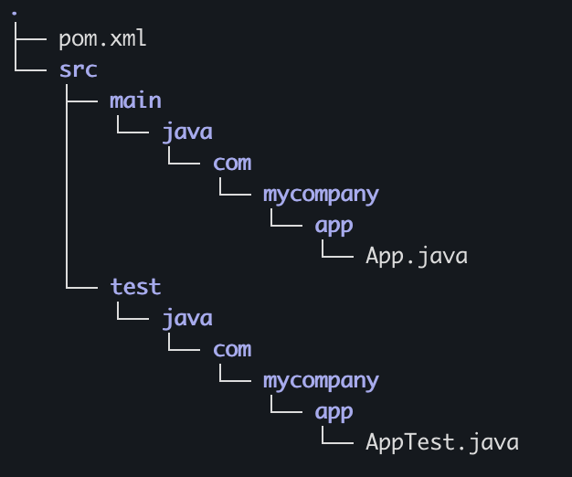

# maven-build
For building a simple maven application

# Install Maven 
    sudo apt install -y maven

## verify Maven Version 
    mvn -version

# Create Java Projects using the [maven-archetype](https://maven.apache.org/guides/introduction/introduction-to-archetypes.html). 

## 1 Generate a Simple Java App (JAR) project

Use the below command to generate a standard project structure Template for a maven build project. 

    mvn archetype:generate -DgroupId=com.mycompany.app -DartifactId=my-app -DarchetypeArtifactId=maven-archetype-quickstart -DarchetypeVersion=1.5 -DinteractiveMode=false

cd into the my-app directory generated by previous command

    cd my-app

Type tree command to see the standard folder structure of  a maven project. If not present, install linux tree command. For ubuntu

    sudo snap install tree

    tree

This should display the folder struture

The **src/main/java** directory contains the project source code, the **src/test/java** directory contains the test source, and the **pom.xml** file is the project's Project Object Model, or POM.

## 2 Generate a Web App (WAR) Project 
 Run the below command to generate a Web App project

    mvn archetype:generate -DgroupId=com.jjtech -DartifactId=JJtechBatchApp -DarchetypeArtifactId=maven-archetype-webapp -DinteractiveMode=false

The above command will generate a standard maven project template for a simple Web Application. Edit folder structure to achieve the desired java structure and add required java source code files. 

## Build WebApp Artifacts 

In the directory with teh pom.xml config file. Build the java Application  using:

    mvn clean package 

This builds the **.War** java artifact that can be deployed on a web server like [Tomca](https://tomcat.apache.org/download-90.cgi). 

# Install Tomcat on Jenkins Server to Serve Java WebApp. 

Download Tomcat v9.0.98 

    wget https://downloads.apache.org/tomcat/tomcat-9/v9.0.98/bin/apache-tomcat-9.0.98.tar.gz

Unzip the downloaded **.tar.gz ** zip file 

    tar -xvzf apache-tomcat-9.0.98.tar.gz 

Move the extracted  binaries to desired Tomcat location

    sudo mv apache-tomcat-9.0.98 /opt/tomcat

Assign ownership of the directory 

    sudo chown -R $USER:$USER /opt/tomcat

Make the oscripts executable:

    chmod +x /opt/tomcat/bin/*.sh

If Server running Jenkins and already using **port 8080** , edit Tomcat config file and change **connector port**  from the default **8080** to **8081** as shown `<Connector port="8081"`. 

    sudo vi /opt/tomcat/conf/server.xml 

Save and Exit

    :wq!

Start Tomcat 

    /opt/tomcat/bin/startup.sh

Access Tomcat on **http://`<server-ip>`:`<tomcat-port>`** 

# Access the Simple WebApp

Copy the **.war** file to Tomcat's **webapps** directory 

    sudo cp target/JJtechBatchApp.war /opt/tomcat/webapps/

Restart Tomcat by running the following scripts 

    /opt/tomcat/bin/shutdown.sh
    /opt/tomcat/bin/startup.sh

Tomcat will auto unpack the **.war** file into a directory with the same name. 

Access Application on Browser with **http://`<server-ip>`:8081/JJtechBatchApp/welcome**

# Test a New Build 

You can modify the Java App source code and test a new build. Edit the **`*.java` source code** with new text. 

In the directory with the pom.xml file, perform a build 

    mvn clean package 

Copy new **build artifact `.war` file** into the Tomcat's webapps directory

    sudo cp target/JJtechBatchApp.war /opt/tomcat/webapps/

Restart the Tomcat server 

    /opt/tomcat/bin/startup.sh

Refresh browser to see new application. 

#  Update the Java Script and build a new artifact. 

Edit the html content of the Java Servelet file. 

    public class WelcomeServlet extends HttpServlet {
    private static final long serialVersionUID = 1L;

    @Override
    protected void doGet(HttpServletRequest request, HttpServletResponse response) throws ServletException, IOException {
        response.setContentType("text/html");
        response.getWriter().println("<h1>Welcome to JJtech Model Batch DevOps Maven Session testing new build artifact</h1>");
    }}
   

NB: Because this changes the expected output of the test case, ensure to **update the expected test output** to ensure the Unit Test does not fail. 

    @Test
    public void testDoGet() throws Exception {
        welcomeServlet.doGet(request, response);
        verify(response).setContentType("text/html");
        assertEquals("<h1>Welcome to JJtech Model Batch DevOps Maven Session testing new build artifact</h1>", responseWriter.toString().trim());
    }

After updating you can test the new version of the application as shown above. 

# Orchestrate Building (CI) and Deployment (CD) Steps using Jenkins and and Tomcat Server.

Follow the instructions in the Tomcat directory to setup a tomcat webserver.

## CI: SetUp a Maven Build Jobs using Jenkins (Generate Artifacts)

### In jenkins, install the **Maven Integration** plugin if not already installed 

In the Jenkins Dashboard, select Manage Jenkins and choose Plugins. Verify if the plugin is already installed. If not installed, install the plugin 

### Create a maven Job

1. Select on New Item, and create a new Job using the (installed) **Maven Project**

2. Under **Source Code Management**, configure your Git repository with the maven project

3. (Optional) Under **Build Triggers**, in addition to the default configure **Poll SCM** 

4. Under **Build**, add relative path to **pom.xml** file in the repository. 

    For **Goals and Options** 

    `clean install package`

5. Apply and Save the Pipeline Configure. Trigger the pipeline to build and Artifact, **`.Jar`** file

6. Install the Maven dependency. 

## CD: Deploy your Artifact to the WebServer(e.g Tomcat)

A) Add Webser credentials so that Jenkins will be able to communicate to Webserver. 

- Click **Manage Jenkins**  and select **Credentials**. 

- Select **global** option and add credentials `(Kind: Username with password)` of user on the **Tomcat** webserver. Jenkins job will use this creds to communicate with Tomcat. 

- complete necessary fields and save. 

B) Configure **Post Build Actions** in the Job created above.

In order to deploy the artifact generate, install the **Deploy to Container** Jenkins plugin.
With this plugin comes additional features. 

In the Post build drop menu, select and configure the action **Deploy war/ear to container**. 

1. for WAR/EAR files, enter 
    **/*.war

2. Leave `context path` and jenkins is able to auto fill the context from the workspace. 

3. For Add Container, select the version of the Tomcat server. here `Tomcat 9.x Remote`

4. Add Credentials. 
    select the credential added above

5. Add URL to your Tomcat server **http://`<server-pub-ip>`:8080**. Tomcat uses default port 8080. 

6. `Apply`, `Save` and `trigger` build.  Jenkins should be able to build and deploy artifacts to the server. 

7. Access application on webser via **http://`<server-pub-ip>`:8080/JJtechBatchApp/welcome**. 

8. Make src code changes. and 

    git add . 

    git commit

    git push

With **Poll SCM** configured, you should have a complete cicd end to end. 

 

    